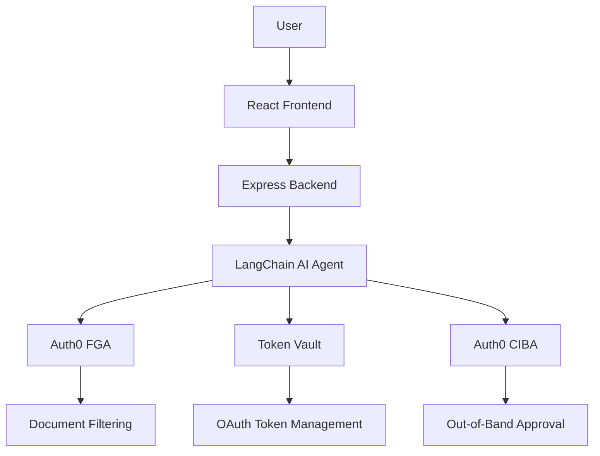

# GuardR[AI]ls - Replication Guide

This document provides comprehensive instructions for replicating the GuardR[AI]ls application - an AI agent demo showcasing Auth0's security features (FGA, Token Vault, and CIBA) with interactive "How it Works" visualizations.

---

## Table of Contents

1. [Overview](#overview)
2. [Tech Stack](#tech-stack)
3. [Prerequisites](#prerequisites)
4. [Project Structure](#project-structure)
5. [Setup Instructions](#setup-instructions)
6. [Auth0 Configuration](#auth0-configuration)
7. [Key Features](#key-features)
8. [Architecture](#architecture)
9. [Troubleshooting](#troubleshooting)

---

## Overview

**GuardR[AI]ls** is a production-ready demonstration application that shows the difference between secured and unsecured AI agent operations. It features:

- **Toggle-based security controls**: Turn Auth0 features on/off to compare
- **Interactive visualizations**: Mermaid diagrams showing how each security feature works
- **Real Auth0 integration**: FGA, Token Vault, and CIBA (simulated) in action
- **Treasury management use case**: Payroll access, transfers, and calendar integration

### What Makes This Unique

1. **Educational visualizations**: Real-time diagrams appear after operations showing exactly how Auth0 protected (or didn't protect) the data
2. **Three diagram types**: Sequence flows, architecture diagrams, and FGA relationship graphs
3. **Toggle comparison**: Instantly see secured vs unsecured behavior
4. **Large screen optimized**: 56px fonts, 4px lines, designed for conference demos

---

## Tech Stack

### Frontend
- **React 19** with TypeScript
- **Vite** for fast development
- **Tailwind CSS** + Shadcn UI components
- **Auth0 React SDK** (@auth0/auth0-react)
- **Mermaid** for diagram rendering (v11+)

### Backend
- **Node.js 22+** with TypeScript
- **Express.js** REST API
- **LangChain.js** for AI agent
- **LiteLLM** or OpenAI GPT models
- **Auth0 Node SDK** (@auth0/auth0-spa-js)
- **Auth0 FGA SDK** (@auth0/fga)

### Security Services
- **Auth0 FGA**: Fine-grained authorization for RAG document filtering
- **Auth0 Token Vault**: Secure OAuth token storage (Connected Accounts)
- **Auth0 CIBA**: Client-Initiated Backchannel Authentication (simulated)

---

## Prerequisites

### Required

1. **Node.js 22+** and npm 10+
2. **Auth0 Account** (free tier works)
3. **LLM Provider**:
   - LiteLLM endpoint, OR
   - OpenAI API key

### Auth0 Setup Requirements

You'll need to create:

1. **Auth0 Application** (Single Page Application)
2. **Auth0 API** (for backend authorization)
3. **Auth0 FGA Store** (for fine-grained authorization)
4. **Auth0 M2M Application** (for FGA and Management API access)
5. **Google Social Connection** (for Token Vault demo)

---

## Project Structure

```
guardrails/
├── frontend/                      # React + Vite frontend
│   ├── src/
│   │   ├── components/
│   │   │   ├── chat/
│   │   │   │   ├── ChatInterface.tsx         # Main chat UI
│   │   │   │   ├── MessageBubble.tsx         # Message rendering
│   │   │   │   ├── SecurityDiagramModal.tsx  # "How it Works" modals
│   │   │   │   ├── ConnectAccountPrompt.tsx  # Google OAuth button
│   │   │   │   └── LoginPrompt.tsx           # Auth0 login prompt
│   │   │   └── ui/                           # Shadcn components
│   │   ├── services/
│   │   │   └── api.ts                        # Backend API calls
│   │   ├── types/
│   │   │   └── index.ts                      # TypeScript interfaces
│   │   ├── App.tsx                           # Root component with toggles
│   │   └── main.tsx                          # Entry point
│   └── .env                                  # Frontend config
│
├── backend/                       # Express backend
│   ├── src/
│   │   ├── routes/
│   │   │   ├── chat.ts                       # Chat endpoint
│   │   │   ├── approvals.ts                  # CIBA approval endpoints
│   │   │   └── connected-accounts.ts         # Token Vault routes
│   │   ├── services/
│   │   │   ├── agent/
│   │   │   │   ├── GuardrAIlsAgent.ts        # Main AI agent
│   │   │   │   └── tools/                    # LangChain tools
│   │   │   │       ├── createViewPayrollTool.ts
│   │   │   │       ├── createTransferTool.ts
│   │   │   │       └── createViewCalendarTool.ts
│   │   │   ├── fga/
│   │   │   │   └── FGAService.ts             # Auth0 FGA integration
│   │   │   ├── token-vault/
│   │   │   │   └── TokenVaultService.ts      # Token management
│   │   │   └── async-auth/
│   │   │       └── AsyncAuthService.ts       # CIBA simulation
│   │   ├── middleware/
│   │   │   └── auth.ts                       # JWT validation
│   │   └── server.ts                         # Express app
│   └── .env                                  # Backend config
│
├── SECURITY_ARCHITECTURE.md       # Mermaid diagrams documentation
├── AUTH0_CIBA_SETUP.md            # CIBA setup guide
├── TOKEN_VAULT_SETUP_GUIDE.md     # Token Vault guide
└── package.json                   # Root workspace config
```

---

## Setup Instructions

### Step 1: Clone and Install

```bash
# Clone the repository
git clone <your-repo-url>
cd guardrails

# Install all dependencies (uses workspaces)
npm install
```

### Step 2: Create Environment Files

Create these `.env` files:

#### `backend/.env`
```env
# Server
PORT=3001
NODE_ENV=development

# LLM Provider (choose one)
LITELLM_BASE_URL=https://your-litellm-endpoint.com
LITELLM_API_KEY=your-litellm-key
LITELLM_MODEL=gpt-4

# OR use OpenAI directly
OPENAI_API_KEY=your-openai-key

# Auth0 Configuration
AUTH0_DOMAIN=your-tenant.auth0.com
AUTH0_AUDIENCE=https://your-api-identifier
AUTH0_CLIENT_ID=your-spa-client-id
AUTH0_CLIENT_SECRET=your-spa-client-secret

# Auth0 FGA
AUTH0_FGA_STORE_ID=your-fga-store-id
AUTH0_FGA_API_URL=https://api.us1.fga.dev
AUTH0_FGA_CLIENT_ID=your-m2m-client-id
AUTH0_FGA_CLIENT_SECRET=your-m2m-client-secret

# Auth0 Management API (for Token Vault)
AUTH0_MGMT_CLIENT_ID=your-m2m-client-id
AUTH0_MGMT_CLIENT_SECRET=your-m2m-client-secret

# Auth0 CIBA (if using real CIBA)
AUTH0_CIBA_CLIENT_ID=your-ciba-client-id
AUTH0_CIBA_CLIENT_SECRET=your-ciba-client-secret
```

#### `frontend/.env`
```env
VITE_AUTH0_DOMAIN=your-tenant.auth0.com
VITE_AUTH0_CLIENT_ID=your-spa-client-id
VITE_AUTH0_AUDIENCE=https://your-api-identifier
VITE_API_URL=http://localhost:3001/api
```

### Step 3: Configure Auth0

See [Auth0 Configuration](#auth0-configuration) section below for detailed steps.

### Step 4: Run the Application

```bash
# Start both frontend and backend
npm run dev

# Or run separately:
npm run dev:frontend  # http://localhost:5173
npm run dev:backend   # http://localhost:3001
```

---

## Auth0 Configuration

### 1. Create Auth0 Application (SPA)

1. Go to Auth0 Dashboard → Applications → Create Application
2. Choose **Single Page Application**
3. Configure:
   - **Allowed Callback URLs**: `http://localhost:5173`, `http://localhost:5173/callback`
   - **Allowed Logout URLs**: `http://localhost:5173`
   - **Allowed Web Origins**: `http://localhost:5173`
   - **Allowed Origins (CORS)**: `http://localhost:5173`
4. Enable **Google** social connection:
   - Connections tab → Enable Google
   - Request scopes: `email`, `profile`, `https://www.googleapis.com/auth/calendar.readonly`
5. Copy **Domain** and **Client ID** to `frontend/.env`

### 2. Create Auth0 API

1. Dashboard → Applications → APIs → Create API
2. Set:
   - **Name**: GuardRails API
   - **Identifier**: `https://guardrails-api` (use as AUDIENCE)
3. Enable **RBAC** and **Add Permissions in Access Token**
4. Copy **Identifier** to both `.env` files as `AUTH0_AUDIENCE`

### 3. Setup Auth0 FGA

1. Go to FGA Dashboard → Create Store
2. Import this authorization model:

```dsl
model
  schema 1.1

type user

type payroll
  relations
    define viewer: [user]
```

3. Add tuples for testing:

```json
[
  {
    "user": "user:auth0|YOUR_USER_ID",
    "relation": "viewer",
    "object": "payroll:EMP006"
  }
]
```

4. Create M2M application for FGA API:
   - Dashboard → Applications → Machine to Machine
   - Authorize for **FGA API**
   - Copy credentials to `backend/.env`

### 4. Setup Token Vault (Connected Accounts)

1. Dashboard → Authentication → Social → Google
2. Configure:
   - Enable **"Connected Accounts for Token Vault"**
   - Scopes: `email profile openid https://www.googleapis.com/auth/calendar.readonly`
3. The Management API credentials (M2M) are used to read tokens

### 5. Setup CIBA (Optional - Currently Simulated)

For real CIBA:
1. Enable **Push Notifications** in Auth0
2. Install **Auth0 Guardian** mobile app
3. Configure CIBA client with `urn:openid:params:grant-type:ciba` grant
4. Update `backend/.env` with CIBA credentials

---

## Key Features

### 1. Security Toggles

Located in the app header (visible when logged in):

- **FGA Toggle**: Controls document filtering in RAG queries
- **Vault Toggle**: Controls OAuth token storage method
- **Async Toggle**: Controls CIBA requirement for high-risk operations

### 2. "How It Works" Modals

Automatically appear after operations to show security flows:

#### For FGA (3 tabs):
- **Sequence Diagram**: Step-by-step flow showing FGA filtering documents
- **Architecture Diagram**: System components showing where FGA fits
- **FGA Visualizer**: Relationship graph showing user → role → permission → resource

#### For Token Vault (2 tabs):
- **Sequence Diagram**: Token storage and exchange flow
- **Architecture Diagram**: Vault architecture with encryption and audit

#### For CIBA (2 tabs):
- **Sequence Diagram**: Out-of-band approval flow
- **Architecture Diagram**: Mobile push notification and polling

### 3. Diagram Configuration

Located in `SecurityDiagramModal.tsx`:

```typescript
// Mermaid initialization
mermaid.initialize({
  theme: 'base',
  themeVariables: { fontSize: '56px' },
  sequence: {
    actorMargin: 350,
    width: 1200,
    height: 320,
    actorFontSize: 56,
    messageFontSize: 54,
    // ... large sizing for screen readability
  }
});
```

Diagrams are optimized for **large screen presentations** with:
- 56px fonts
- 4px line weights
- 2.5x arrow markers
- Scrollable content

### 4. Mock Data

The app includes realistic mock data:

**Payroll Records** (`backend/src/services/data/treasury.ts`):
- 6 employees with salaries, titles, departments
- FGA controls which records user can see

**Calendar Events** (frontend generates):
- 3 realistic events (10 AM meeting, 2 PM review, 5:30 PM personal)
- Weekday-only scheduling
- Shown after Google Calendar connection

**Transfer Operations**:
- $50,000 threshold triggers CIBA
- Mock execution with transaction IDs
- Approval/denial flow simulation

---

## Architecture

### Security Flow Overview



### Key Components

1. **GuardrAIlsAgent** (`backend/src/services/agent/GuardrAIlsAgent.ts`)
   - LangChain agent with multiple tools
   - Checks security toggles before operations
   - Returns structured responses

2. **FGAService** (`backend/src/services/fga/FGAService.ts`)
   - Checks user permissions against FGA tuples
   - Filters payroll records based on viewer relations
   - Uses Auth0 FGA SDK

3. **TokenVaultService** (`backend/src/services/token-vault/TokenVaultService.ts`)
   - Retrieves OAuth tokens from Auth0
   - Uses Management API to read user identities
   - Returns Google access tokens for calendar access

4. **AsyncAuthService** (`backend/src/services/async-auth/AsyncAuthService.ts`)
   - Simulates CIBA flow (can be replaced with real CIBA)
   - Creates approval requests for high-risk operations
   - Blocking wait for approval (2-minute timeout)

5. **SecurityDiagramModal** (`frontend/src/components/chat/SecurityDiagramModal.tsx`)
   - Renders Mermaid diagrams in large modal
   - 3 tabs for FGA, 2 tabs for others
   - Dynamic diagram generation based on toggle state

---

## Troubleshooting

### "FGA Check Failed"

**Cause**: FGA store not configured or tuples missing

**Fix**:
1. Verify `AUTH0_FGA_STORE_ID` in `backend/.env`
2. Check FGA credentials (M2M app)
3. Add test tuples in FGA Dashboard
4. Ensure authorization model is uploaded

### "Token Vault: Connection Not Found"

**Cause**: Google not connected or token not in user identity

**Fix**:
1. Verify user logged in WITH Google (not email/password)
2. Check Google social connection has required scopes
3. Enable "Connected Accounts" in Google connection settings
4. Re-login to get fresh tokens

### "Diagram Too Small"

**Cause**: Browser zoom or missing CSS

**Fix**:
1. Use browser zoom (Cmd/Ctrl + +)
2. Check `fontSize` in mermaid.initialize()
3. Verify `transform: scale()` values in CSS
4. Check container `minHeight` and `width` styles

### "CIBA Not Working"

**Cause**: Currently uses simulated CIBA

**Expected**:
- Shows "Waiting for approval" message
- Simulates 5-second approval wait
- Then executes transfer

**To enable real CIBA**:
1. Configure Auth0 CIBA client
2. Update `backend/.env` with CIBA credentials
3. Install Auth0 Guardian mobile app
4. Update `AsyncAuthService.ts` to use real Auth0 CIBA endpoints

### Backend Won't Start

**Check**:
1. Port 3001 not in use: `lsof -ti:3001`
2. All required env vars present in `backend/.env`
3. Node version: `node -v` (should be 22+)
4. Dependencies installed: `cd backend && npm install`

### Frontend Build Fails

**Check**:
1. TypeScript errors: `npm run build`
2. Missing dependencies: `cd frontend && npm install`
3. `.env` file exists in `frontend/`
4. Vite config correct (should use port 5173)

---

## Additional Resources

- **SECURITY_ARCHITECTURE.md**: Full Mermaid diagrams for all security features
- **AUTH0_CIBA_SETUP.md**: Detailed CIBA configuration
- **TOKEN_VAULT_SETUP_GUIDE.md**: Token Vault setup walkthrough
- **Auth0 Docs**: https://auth0.com/docs
- **Auth0 FGA Docs**: https://fga.dev
- **Mermaid Docs**: https://mermaid.js.org

---

## License

MIT

---

## Credits

Built with Auth0, React, LangChain, and Mermaid for demonstrating AI agent security best practices.
